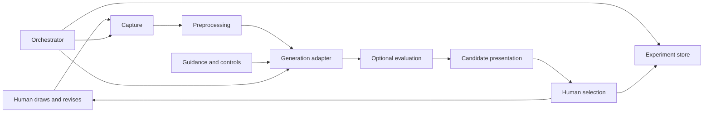

# Architecture guidance

Status: proposed design for implementation, except the minimal Python scaffold established by ADR 0001. These choices implement the proposal; they are not additional requirements from it.

## Boundaries

The orchestrator records all stage inputs, effective configuration, outputs, errors, and timing, not just generation. The UI invokes application operations and does not own model logic or persistence.

| Planned boundary | Responsibility | Replaceability rule |
| --- | --- | --- |
| `domain` | Serializable contracts and identifiers | No camera, model, UI, or tracking SDK imports |
| `capture` | Acquire image plus capture metadata | File/synthetic source for tests; real camera adapter for delivery |
| `preprocessing` | Named, configurable image transformations | Retain input and transformation provenance; no generation calls |
| `generation` | Capabilities, request validation, candidate generation | Backend-specific objects stay inside adapters |
| `evaluation` | Optional scoring/filtering of candidates | No hidden human-selection decisions; preserve original candidates |
| `orchestration` | Execute a manual iteration and link it to history | Inject adapters; do not select a provider globally |
| `experiments` | Durable records, artifact integrity, load/replay | UI and model adapters do not write storage directly |
| `ui` | Preview, controls, progress, alternatives, selection, history | Use library operations; keep framework types outside domain |

Create modules when their first vertical slice needs them; empty directory trees are not a modular implementation.

## First contracts (task T01)

Use typed records and Python protocols or equivalent small interfaces. Prefer plain serializable metadata with schema versions.

T01a (accepted, not implemented) defines `sketchloop.domain`, `sketchloop.generation`, and a labelled fake in `sketchloop.fakes`. See [the T01a design](design/t01a-contracts.md) and [ADR 0005](decisions/0005-domain-records-and-generator-contract.md). Records reference images through `ImageRef`, and bytes stay in transient generation output. `Generator.capabilities()` declares supported controls, `validate_request` reports every unsupported setting, and `generate(request)` returns candidates with adapter-reported effective settings and backend identity. Selection is an explicit event limited to the iteration's candidates. Iteration status, failures, and retries are deferred to T05.

Later contracts, still proposals:

- `CaptureSource.capture()` returns a captured image and metadata (T02).
- `Preprocessor.process(capture, config)` returns processed image(s) and ordered transformation metadata (T02).
- `Evaluator.evaluate(candidates, context)` returns scores/filter decisions without mutating candidates; no-op evaluation is valid (T04).
- `ExperimentStore` creates/loads runs, stores artifacts, appends iterations and selection events, and reconstructs replay requests.
- An application service runs an iteration and records explicit selection separately. Candidate IDs must belong to the iteration being selected.

Define failure types for capture unavailable, invalid image, unsupported configuration, backend failure/timeout, and persistence failure. Keep an incomplete run visible as failed; never label partial output complete or overwrite the previous successful iteration. Retry creates a new attempt linked to the original.

## Practical defaults and pending decisions

Start locally, with one user and manual triggering. A filesystem artifact store with versioned JSON metadata is a candidate baseline, not a committed schema. An external tracker can be added behind the store interface if justified. Do not require MLflow merely because it appears in the references.

OpenCV, Diffusers, and Gradio are candidates for capture/processing, generation, and a thin local UI respectively. Evaluate them against actual camera, operating system, memory, accelerator, model license, and interaction requirements before adoption. No such dependency is installed in this scaffold. Record decisions and compatible dependency versions in ADRs.

The first model decision must cover sketch conditioning, visual quality, supported guidance, memory/latency, local versus remote execution, availability/version pinning, license, and replay limits. Known hardware: a Windows laptop without a GPU, a laptop or USB webcam, and possibly a GPU or Colab later. Keep the generator interface usable both in-process and against a remote runtime such as Colab. Do not choose a paid provider on behalf of the researcher. Contracts, synthetic fixtures, and offline orchestration can proceed while this remains open.

## Expansion seams

Preserve explicit iteration identity and stage timing now so later streaming work can add scheduling, cancellation, backpressure, and stale-result suppression. Do not build a streaming service before the manual baseline works. Additional evaluators, models, and presentation modes should reuse the same core. Formal multi-user support and participant identity systems are deferred.
